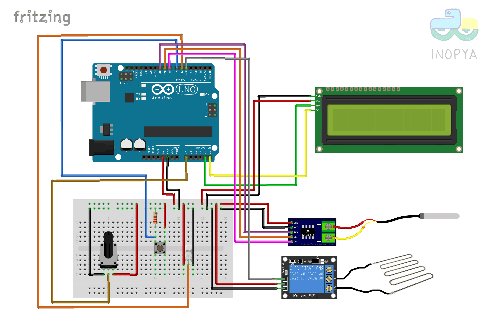
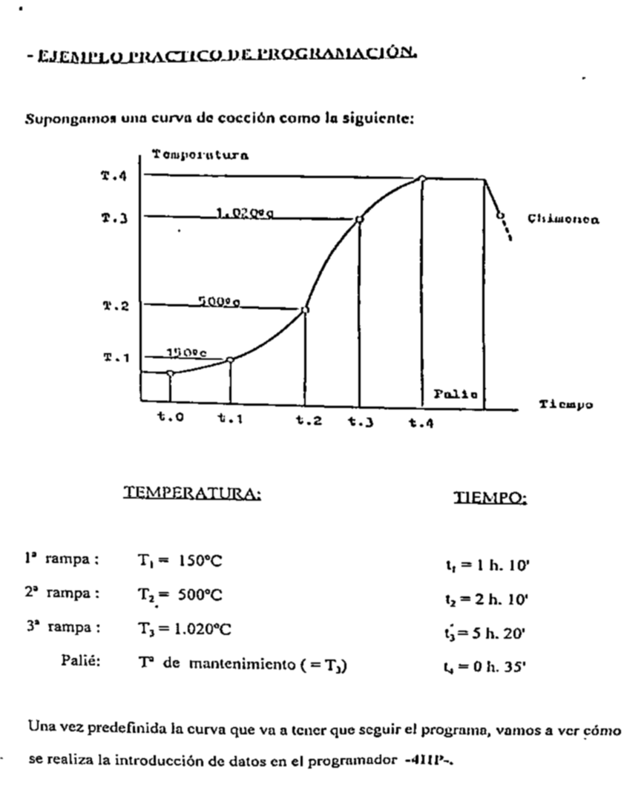

# Control de horno para cocción de cerámica
Utilidad Arduino para el control de un horno de cocción de piezas cerámicas

Esquema sobre protoboard del montaje Arduino.

Ejemplo de curva de coccion (del manual del automata original del horno).

